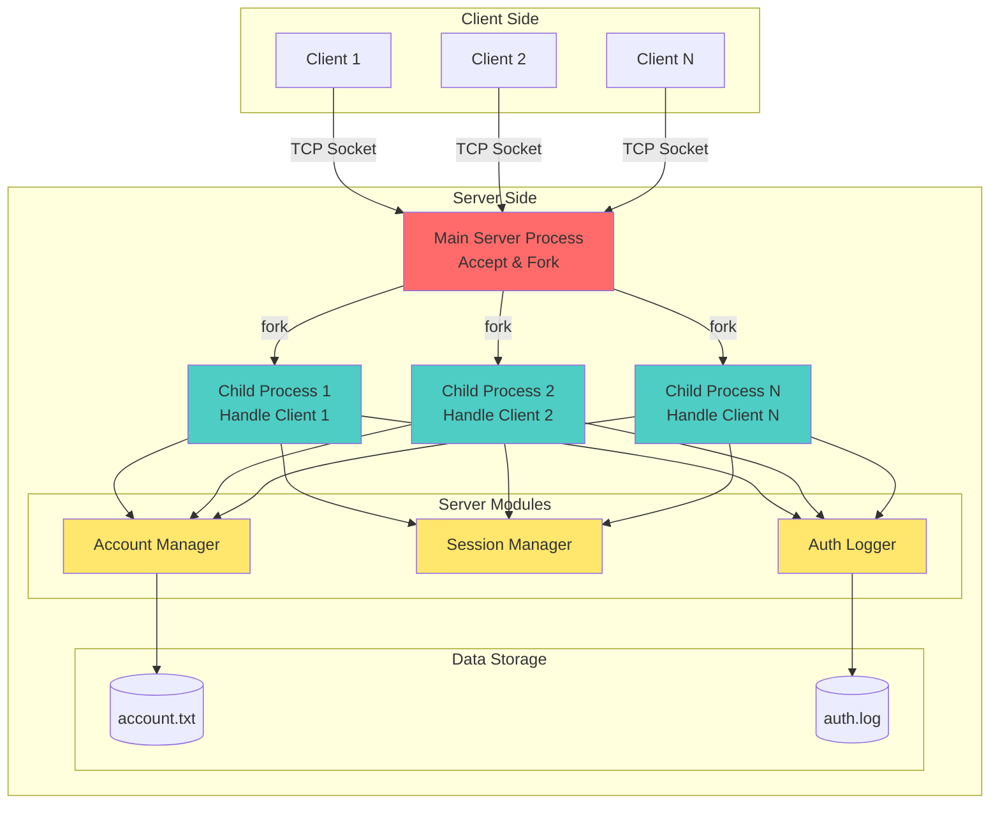
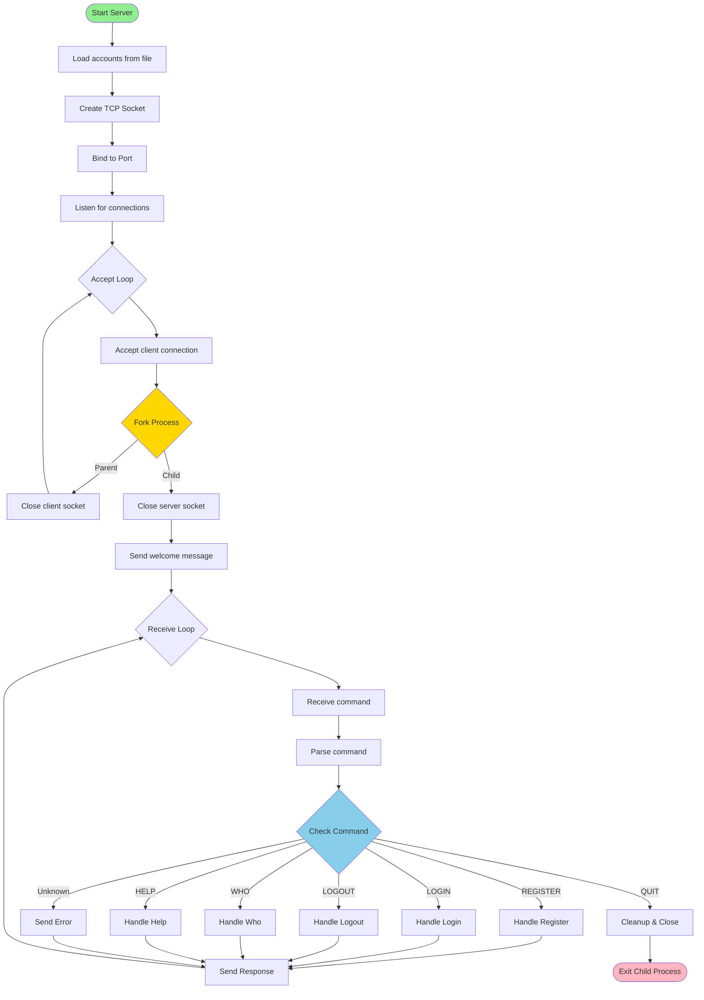
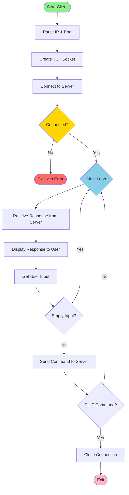
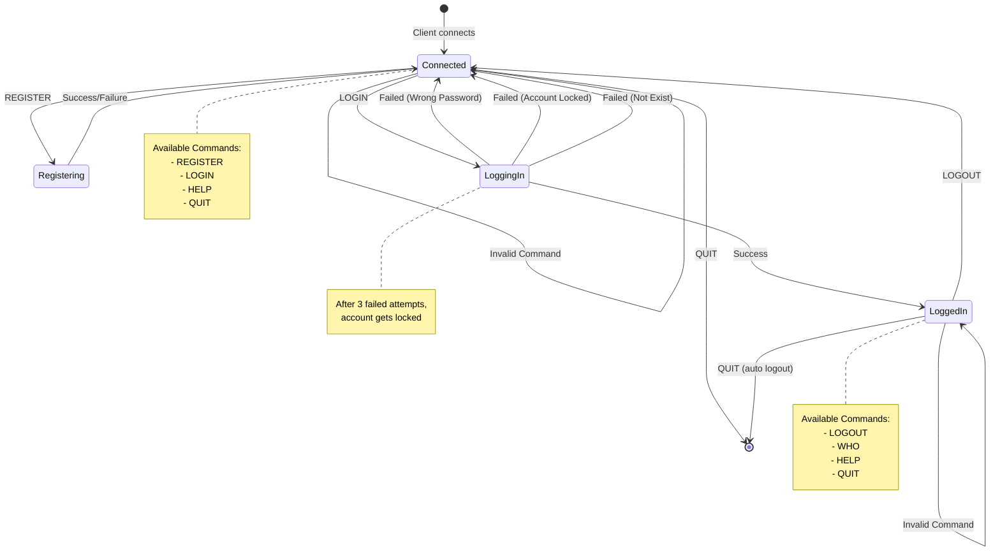
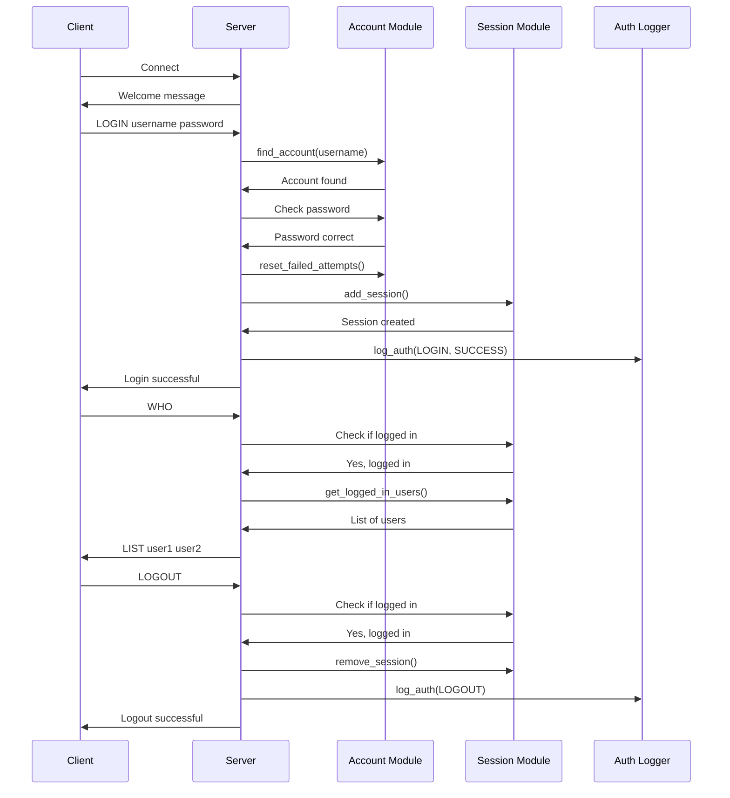
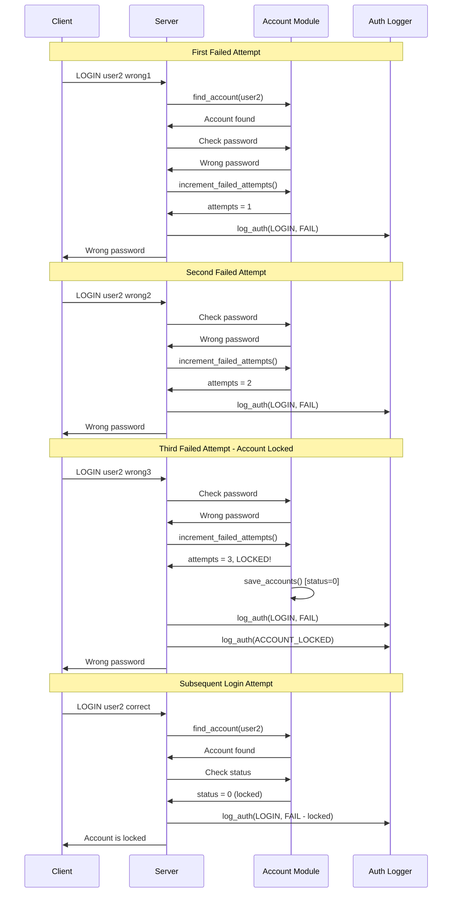
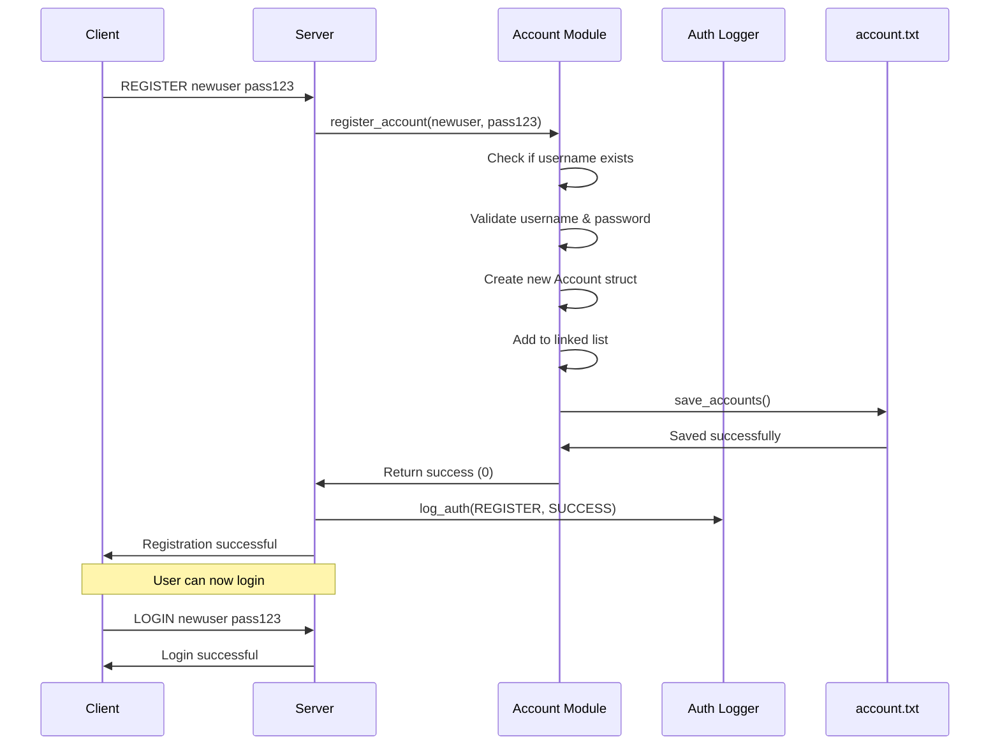
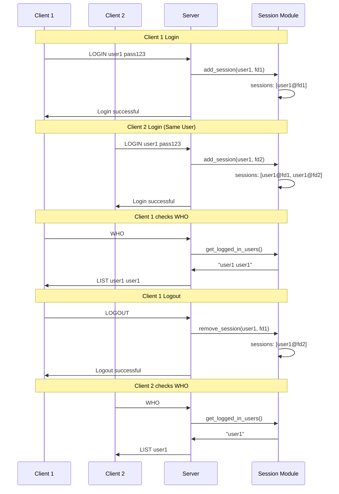
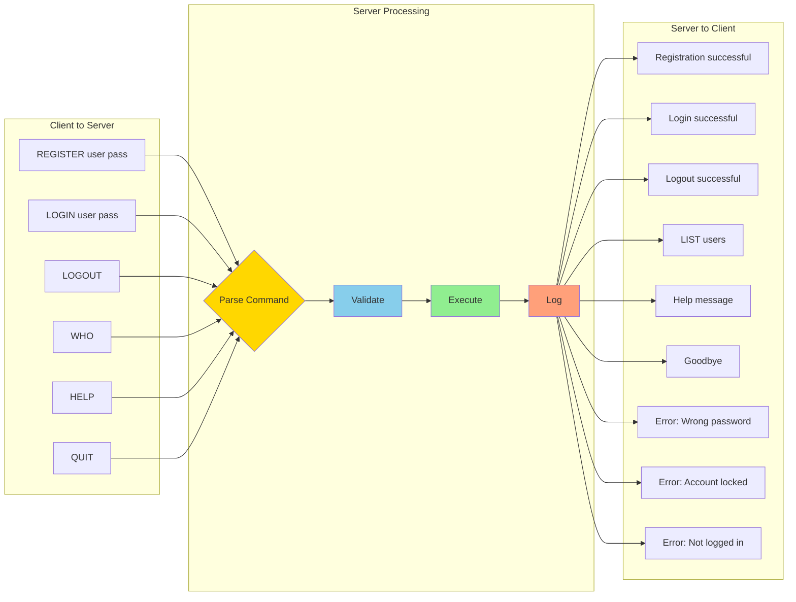
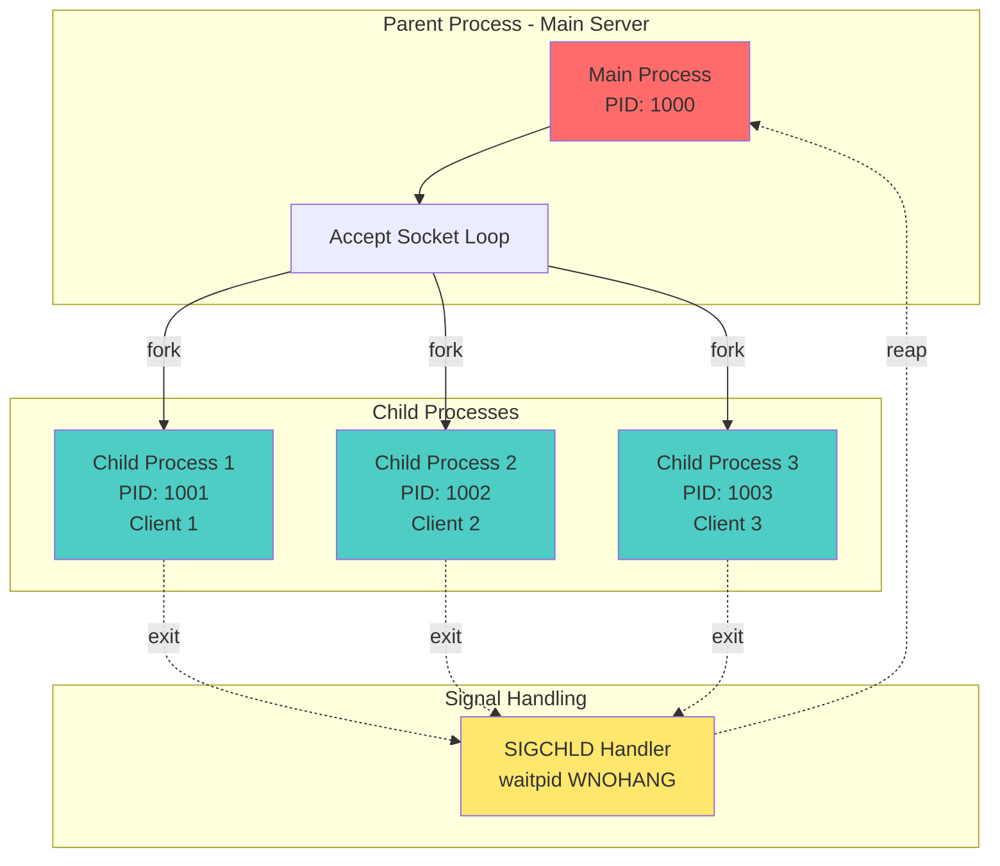

# BÁO CÁO BÀI TẬP LẬP TRÌNH MẠNG
## ỨNG DỤNG TCP SOCKET VỚI FORK() HỖ TRỢ ĐĂNG KÝ, ĐĂNG NHẬP VÀ ĐĂNG XUẤT

**Sinh viên thực hiện:** [Tên sinh viên]  
**MSSV:** [Mã số sinh viên]  
**Lớp:** [Lớp]  
**Ngày:** 30/11/2025

---

## 1. MỤC ĐÍCH BÀI TẬP

Xây dựng ứng dụng client-server sử dụng TCP socket với cơ chế xử lý đa tiến trình (fork()) để:
- Quản lý đăng ký, đăng nhập và đăng xuất người dùng
- Hỗ trợ nhiều client kết nối đồng thời
- Bảo mật tài khoản với cơ chế khóa tự động sau 3 lần đăng nhập sai
- Ghi log lịch sử xác thực

---

## 2. YÊU CẦU BÀI TẬP

### 2.1. Yêu cầu chung
- Sử dụng TCP socket
- Sử dụng fork() để xử lý đa client
- Mỗi cửa sổ client chỉ đăng nhập được 1 tài khoản
- Mỗi tài khoản có thể đăng nhập trên nhiều cửa sổ
- Tài khoản bị khóa sau 3 lần đăng nhập sai
- Lưu trữ tài khoản trong file `account.txt`
- Ghi log vào file `auth.log`

### 2.2. Yêu cầu Server
- Chạy với tham số dòng lệnh: `./server PortNumber`
- Lắng nghe kết nối từ client
- Xử lý các lệnh: REGISTER, LOGIN, LOGOUT, WHO, HELP, QUIT

### 2.3. Yêu cầu Client
- Kết nối với tham số: `./client IPAddress PortNumber`
- Gửi lệnh đến server và nhận phản hồi
- Giao diện command-line đơn giản

### 2.4. Giao thức ứng dụng
- Text-based protocol
- Format request: `COMMAND [arg1] [arg2]`
- Format response: thông báo trực tiếp

---

## 3. THIẾT KẾ HỆ THỐNG

### 3.1. Kiến trúc tổng quan



### 3.2. Cấu trúc dữ liệu

#### 3.2.1. Account (Tài khoản)
```c
typedef struct Account {
    char username[MAX_USERNAME];      // Tên đăng nhập
    char password[MAX_PASSWORD];      // Mật khẩu
    int status;                       // 0: locked, 1: active
    int failed_attempts;              // Số lần đăng nhập sai
    struct Account* next;             // Con trỏ đến tài khoản tiếp theo
} Account;
```

#### 3.2.2. Session (Phiên làm việc)
```c
typedef struct Session {
    char username[MAX_USERNAME];      // Tên người dùng đang đăng nhập
    char ip_address[50];              // Địa chỉ IP
    int port;                         // Cổng kết nối
    int client_fd;                    // File descriptor của client
    struct Session* next;             // Con trỏ đến session tiếp theo
} Session;
```

### 3.3. Sơ đồ luồng xử lý

#### 3.3.1. Server Flow


#### 3.3.2. Client Flow


---

## 4. CÀI ĐẶT CHI TIẾT

### 4.1. Cấu trúc thư mục

```
Week11/
├── server.c          # Mã nguồn server
├── client.c          # Mã nguồn client
├── account.c         # Quản lý tài khoản
├── account.h         # Header file tài khoản
├── session.c         # Quản lý phiên đăng nhập
├── session.h         # Header file session
├── auth_log.c        # Ghi log xác thực
├── auth_log.h        # Header file auth log
├── account.txt       # File lưu tài khoản
├── auth.log          # File log
├── Makefile          # Script biên dịch
└── README.md         # Hướng dẫn sử dụng
```

### 4.2. Module chính

#### 4.2.1. Server Module (`server.c`)

**Chức năng chính:**
- Khởi tạo và quản lý TCP socket server
- Sử dụng `fork()` để tạo tiến trình con cho mỗi client
- Xử lý SIGCHLD để tránh zombie process
- Điều phối các lệnh đến handler tương ứng

**Các hàm quan trọng:**
- `main()`: Khởi tạo server, accept và fork
- `sigchld_handler()`: Xử lý tín hiệu SIGCHLD
- `handle_client()`: Xử lý giao tiếp với client
- `handle_register()`: Xử lý đăng ký tài khoản
- `handle_login()`: Xử lý đăng nhập
- `handle_logout()`: Xử lý đăng xuất
- `handle_who()`: Liệt kê người dùng online
- `handle_help()`: Hiển thị trợ giúp

**Đặc điểm kỹ thuật:**
```c
// Sử dụng fork() để xử lý nhiều client
pid_t pid = fork();
if (pid == 0) {
    // Child process
    close(sockfd);
    handle_client(clientfd, clientAddr);
    exit(EXIT_SUCCESS);
} else {
    // Parent process
    close(clientfd);
}
```

#### 4.2.2. Client Module (`client.c`)

**Chức năng chính:**
- Kết nối đến server qua TCP socket
- Gửi lệnh và nhận phản hồi
- Giao diện dòng lệnh đơn giản

**Đặc điểm:**
- Blocking I/O: nhận response trước, sau đó mới nhập lệnh
- Tự động chuyển lệnh sang chữ hoa
- Thoát khi nhận lệnh QUIT

#### 4.2.3. Account Module (`account.c`, `account.h`)

**Chức năng:**
- `load_accounts()`: Đọc tài khoản từ file
- `save_accounts()`: Lưu tài khoản vào file
- `find_account()`: Tìm kiếm tài khoản
- `register_account()`: Đăng ký tài khoản mới
- `increment_failed_attempts()`: Tăng số lần đăng nhập sai
- `reset_failed_attempts()`: Reset số lần sai
- `update_account_status()`: Cập nhật trạng thái tài khoản
- `free_accounts()`: Giải phóng bộ nhớ

**File format (`account.txt`):**
```
username password status
user1 pass123 1
user2 pass456 0
admin admin123 1
```

#### 4.2.4. Session Module (`session.c`, `session.h`)

**Chức năng:**
- `add_session()`: Thêm phiên đăng nhập
- `remove_session()`: Xóa phiên khi logout
- `is_logged_in()`: Kiểm tra trạng thái đăng nhập
- `get_username_by_fd()`: Lấy username từ file descriptor
- `get_logged_in_users()`: Lấy danh sách user online
- `free_sessions()`: Giải phóng bộ nhớ

**Đặc điểm:**
- Hỗ trợ một user đăng nhập trên nhiều cửa sổ
- Mỗi session được định danh bởi `client_fd`

#### 4.2.5. Auth Log Module (`auth_log.c`, `auth_log.h`)

**Chức năng:**
- `log_auth()`: Ghi log các sự kiện xác thực

**File format (`auth.log`):**
```
[2025-11-30 10:15:30] REGISTER user1 from 127.0.0.1:54321 SUCCESS
[2025-11-30 10:16:45] LOGIN user1 from 127.0.0.1:54321 SUCCESS
[2025-11-30 10:17:20] LOGIN user2 from 127.0.0.1:54322 FAIL (wrong password)
[2025-11-30 10:17:30] ACCOUNT_LOCKED user2
[2025-11-30 10:20:15] LOGOUT user1 from 127.0.0.1:54321
```

### 4.3. Giao thức ứng dụng

#### 4.3.1. Biểu đồ trạng thái Application Protocol



#### 4.3.2. Sequence Diagram - Successful Login Flow



#### 4.3.3. Sequence Diagram - Failed Login (Account Lock)



#### 4.3.4. Sequence Diagram - Register New Account



#### 4.3.5. Multi-Client Session Management



#### 4.3.6. Các lệnh hỗ trợ

| Lệnh | Cú pháp | Mô tả |
|------|---------|-------|
| REGISTER | `REGISTER <username> <password>` | Đăng ký tài khoản mới |
| LOGIN | `LOGIN <username> <password>` | Đăng nhập |
| LOGOUT | `LOGOUT` | Đăng xuất |
| WHO | `WHO` | Xem danh sách user online |
| HELP | `HELP` | Hiển thị trợ giúp |
| QUIT | `QUIT` | Ngắt kết nối |

#### 4.3.7. Protocol Message Flow



#### 4.3.8. Fork() Process Architecture



#### 4.3.9. Các lệnh hỗ trợ

**REGISTER:**
- Thành công: `Registration successful.`
- Lỗi:
  - `Username already exists`
  - `Invalid username`
  - `Invalid password`
  - `Registration failed`

**LOGIN:**
- Thành công: `Login successful.`
- Lỗi:
  - `Already logged in`
  - `Account does not exist`
  - `Account is locked`
  - `Wrong password`

**LOGOUT:**
- Thành công: `Logout successful.`
- Lỗi: `Not logged in`

**WHO:**
- Format: `LIST user1 user2 user3`
- Lỗi: `Not logged in`

---

## 5. HƯỚNG DẪN SỬ DỤNG

### 5.1. Biên dịch chương trình

```bash
cd Week11
make
```

Output:
```
gcc -Wall -g -c server.c -o server.o
gcc -Wall -g -c account.c -o account.o
gcc -Wall -g -c session.c -o session.o
gcc -Wall -g -c auth_log.c -o auth_log.o
gcc -Wall -g -o server server.o account.o session.o auth_log.o
gcc -Wall -g -c client.c -o client.o
gcc -Wall -g -o client client.o -lpthread
```

### 5.2. Chạy Server

```bash
./server 8080
```

Output:
```
Server listening on port 8080...
```

### 5.3. Chạy Client

**Terminal 1:**
```bash
./client 127.0.0.1 8080
```

**Terminal 2:**
```bash
./client 127.0.0.1 8080
```

### 5.4. Ví dụ sử dụng

#### Ví dụ 1: Đăng ký và đăng nhập

```
Connected to server 127.0.0.1:8080
Type HELP for available commands.
REGISTER user1 password123
Registration successful.
LOGIN user1 password123
Login successful.
WHO
LIST user1
LOGOUT
Logout successful.
QUIT
Goodbye!
```

#### Ví dụ 2: Đăng nhập sai 3 lần

```
Connected to server 127.0.0.1:8080
Type HELP for available commands.
LOGIN user2 wrong1
Wrong password
LOGIN user2 wrong2
Wrong password
LOGIN user2 wrong3
Wrong password
LOGIN user2 correct_password
Account is locked
```

#### Ví dụ 3: Nhiều client cùng user

**Client 1:**
```
LOGIN user1 pass123
Login successful.
WHO
LIST user1
```

**Client 2:**
```
LOGIN user1 pass123
Login successful.
WHO
LIST user1 user1
```

---

## 6. KIỂM THỬ

### 6.1. Test case 1: Đăng ký tài khoản

| Input | Expected Output | Status |
|-------|----------------|--------|
| `REGISTER user1 pass123` | `Registration successful.` | ✅ PASS |
| `REGISTER user1 pass456` | `Username already exists` | ✅ PASS |
| `REGISTER "" pass123` | `Invalid username` | ✅ PASS |

### 6.2. Test case 2: Đăng nhập

| Input | Expected Output | Status |
|-------|----------------|--------|
| `LOGIN user1 pass123` | `Login successful.` | ✅ PASS |
| `LOGIN user1 wrong` | `Wrong password` | ✅ PASS |
| `LOGIN nonexist pass` | `Account does not exist` | ✅ PASS |
| `LOGIN locked_user pass` | `Account is locked` | ✅ PASS |

### 6.3. Test case 3: Khóa tài khoản

| Step | Action | Expected Result | Status |
|------|--------|-----------------|--------|
| 1 | `LOGIN user2 wrong1` | `Wrong password` | ✅ PASS |
| 2 | `LOGIN user2 wrong2` | `Wrong password` | ✅ PASS |
| 3 | `LOGIN user2 wrong3` | `Wrong password` | ✅ PASS |
| 4 | Check `account.txt` | `user2 pass 0` | ✅ PASS |
| 5 | `LOGIN user2 correct` | `Account is locked` | ✅ PASS |

### 6.4. Test case 4: Nhiều client

| Client 1 | Client 2 | Expected | Status |
|----------|----------|----------|--------|
| `LOGIN user1 pass` | - | Success | ✅ PASS |
| - | `LOGIN user1 pass` | Success | ✅ PASS |
| `WHO` | - | `LIST user1 user1` | ✅ PASS |
| `LOGOUT` | - | Success | ✅ PASS |
| - | `WHO` | `LIST user1` | ✅ PASS |

### 6.5. Test case 5: Fork và process management

| Scenario | Expected Result | Status |
|----------|----------------|--------|
| 3 clients kết nối đồng thời | 3 child processes được tạo | ✅ PASS |
| Client ngắt kết nối | Child process kết thúc | ✅ PASS |
| Không có zombie process | `ps aux | grep defunct` = empty | ✅ PASS |

---

## 7. KẾT QUẢ ĐẠT ĐƯỢC

### 7.1. Các chức năng đã hoàn thành

✅ **Server:**
- Khởi tạo TCP socket và listen trên port từ tham số
- Sử dụng fork() để xử lý đa client
- Xử lý SIGCHLD để tránh zombie process
- Hỗ trợ đầy đủ các lệnh: REGISTER, LOGIN, LOGOUT, WHO, HELP, QUIT

✅ **Client:**
- Kết nối đến server với IP và port từ tham số
- Gửi lệnh và nhận phản hồi
- Giao diện command-line thân thiện

✅ **Quản lý tài khoản:**
- Lưu trữ và đọc từ file `account.txt`
- Đăng ký tài khoản mới
- Kiểm tra username, password
- Khóa tài khoản sau 3 lần đăng nhập sai

✅ **Quản lý phiên:**
- Một client chỉ đăng nhập được 1 tài khoản
- Một tài khoản có thể đăng nhập trên nhiều client
- Theo dõi và hiển thị danh sách user online

✅ **Logging:**
- Ghi log vào file `auth.log`
- Timestamp cho mỗi sự kiện
- Log các sự kiện: REGISTER, LOGIN, LOGOUT, ACCOUNT_LOCKED

### 7.2. Các điểm mạnh

1. **Kiến trúc module hóa:** Code được tách thành các module rõ ràng (account, session, auth_log)
2. **Sử dụng fork() hiệu quả:** Mỗi client được xử lý bởi một process riêng
3. **Quản lý process tốt:** Xử lý SIGCHLD tránh zombie process
4. **Bảo mật:** Cơ chế khóa tài khoản sau 3 lần sai
5. **Logging đầy đủ:** Ghi lại tất cả hoạt động xác thực
6. **Error handling:** Xử lý lỗi và thông báo rõ ràng

---

## 8. HẠNG CHẾ VÀ HƯỚNG PHÁT TRIỂN

### 8.1. Hạn chế hiện tại

1. **Bảo mật:**
   - Mật khẩu lưu dưới dạng plaintext
   - Không có mã hóa khi truyền dữ liệu
   - Không có cơ chế xác thực phức tạp

2. **Đồng bộ:**
   - Không có cơ chế lock khi nhiều process cùng ghi file
   - Race condition có thể xảy ra với `account.txt`

3. **Client:**
   - Giao diện command-line đơn giản
   - Blocking I/O, phải đợi response mới nhập tiếp

4. **Hiệu năng:**
   - Fork() tốn tài nguyên với số lượng client lớn
   - Không giới hạn số lượng connection

### 8.2. Hướng phát triển

1. **Bảo mật:**
   - Hash mật khẩu bằng SHA-256 hoặc bcrypt
   - Sử dụng SSL/TLS để mã hóa truyền thông
   - Thêm CAPTCHA sau nhiều lần đăng nhập sai

2. **Đồng bộ:**
   - Sử dụng file locking hoặc semaphore
   - Chuyển sang database (SQLite, MySQL)
   - Shared memory cho session management

3. **Hiệu năng:**
   - Sử dụng thread pool thay vì fork()
   - Sử dụng epoll/select cho I/O multiplexing
   - Giới hạn số connection tối đa

4. **Tính năng:**
   - Thêm chat giữa các user
   - Gửi/nhận file
   - Thay đổi mật khẩu
   - Quên mật khẩu (reset qua email)
   - Admin panel để quản lý user

5. **Client:**
   - GUI với GTK+ hoặc Qt
   - Non-blocking I/O với threads
   - Tự động reconnect khi mất kết nối

---

## 9. KẾT LUẬN

Bài tập đã hoàn thành đầy đủ các yêu cầu đề ra:
- ✅ Sử dụng TCP socket
- ✅ Sử dụng fork() để xử lý đa client
- ✅ Hỗ trợ đăng ký, đăng nhập, đăng xuất
- ✅ Một client chỉ đăng nhập 1 tài khoản
- ✅ Một tài khoản có thể đăng nhập nhiều cửa sổ
- ✅ Khóa tài khoản sau 3 lần sai
- ✅ Lưu trữ trong `account.txt`
- ✅ Ghi log vào `auth.log`
- ✅ Text-based protocol
- ✅ Makefile với file thực thi `server` và `client`

Qua bài tập này, em đã nắm vững:
1. Lập trình socket TCP trong C
2. Sử dụng fork() để xử lý đa tiến trình
3. Quản lý process và xử lý signal (SIGCHLD)
4. Thiết kế giao thức ứng dụng
5. Quản lý file và logging
6. Cấu trúc dữ liệu linked list
7. Kỹ năng debug và kiểm thử

---

## PHU LỤC

### A. Makefile

```makefile
CC = gcc
CFLAGS = -Wall -g

SERVER_SRC = server.c account.c session.c auth_log.c
CLIENT_SRC = client.c
SERVER_OBJ = $(SERVER_SRC:.c=.o)
CLIENT_OBJ = $(CLIENT_SRC:.c=.o)

all: server client

server: $(SERVER_OBJ)
	$(CC) $(CFLAGS) -o server $(SERVER_OBJ)

client: $(CLIENT_OBJ)
	$(CC) $(CFLAGS) -o client $(CLIENT_OBJ) -lpthread

%.o: %.c
	$(CC) $(CFLAGS) -c $< -o $@

clean:
	rm -f $(SERVER_OBJ) $(CLIENT_OBJ) server client

.PHONY: all clean
```

### B. Cấu trúc Protocol

**Request Format:**
```
COMMAND [ARG1] [ARG2]\n
```

**Response Format:**
```
<message>\n
```

### C. File Examples

**account.txt:**
```
user1 pass123 1
user2 pass456 1
admin admin123 1
locked_user pass789 0
```

**auth.log:**
```
[2025-11-30 14:30:15] REGISTER user1 from 127.0.0.1:54321 SUCCESS
[2025-11-30 14:31:22] LOGIN user1 from 127.0.0.1:54321 SUCCESS
[2025-11-30 14:32:10] WHO user1
[2025-11-30 14:35:45] LOGOUT user1 from 127.0.0.1:54321
[2025-11-30 14:36:12] LOGIN user2 from 127.0.0.1:54322 FAIL (wrong password)
[2025-11-30 14:36:30] LOGIN user2 from 127.0.0.1:54322 FAIL (wrong password)
[2025-11-30 14:36:45] LOGIN user2 from 127.0.0.1:54322 FAIL (wrong password)
[2025-11-30 14:36:45] ACCOUNT_LOCKED user2
```

---

**Ghi chú:** Báo cáo này được soạn thảo dựa trên code thực tế đã cài đặt và kiểm thử thành công.
