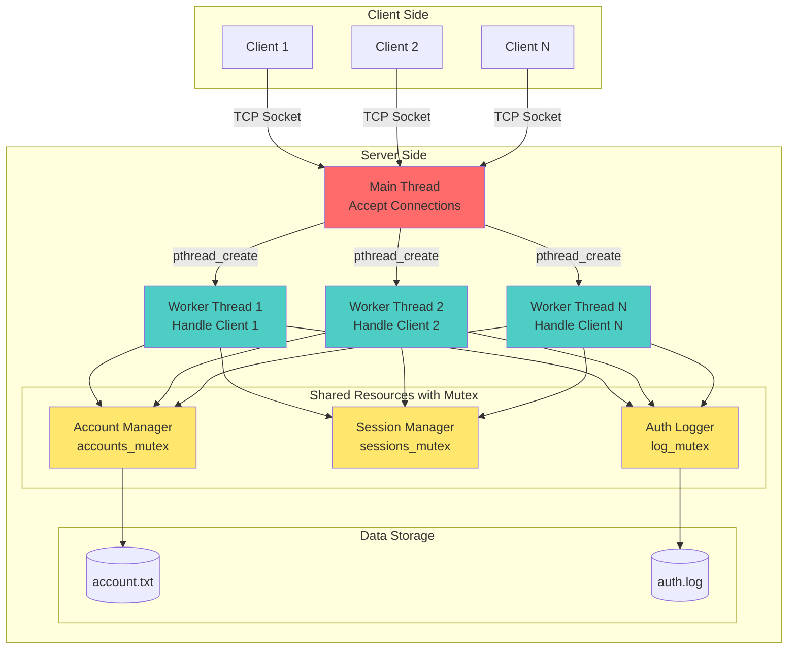
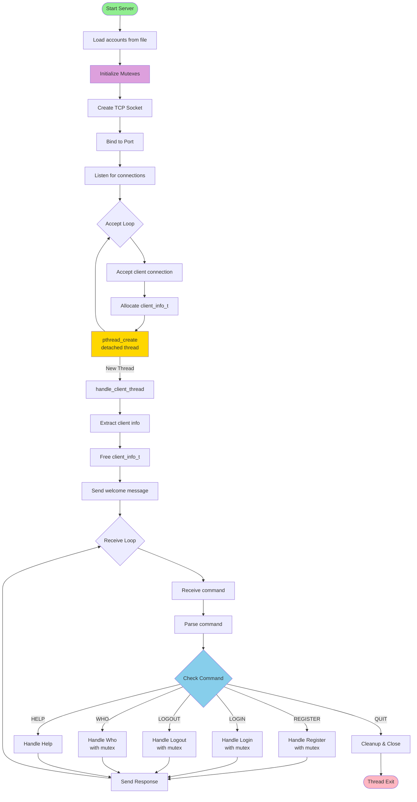
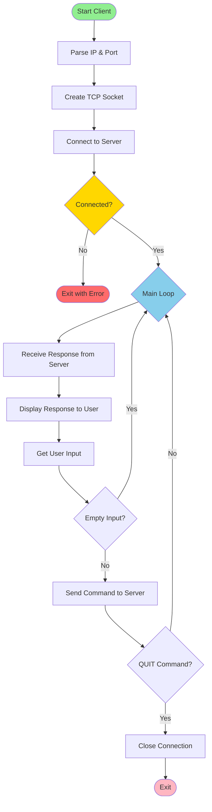
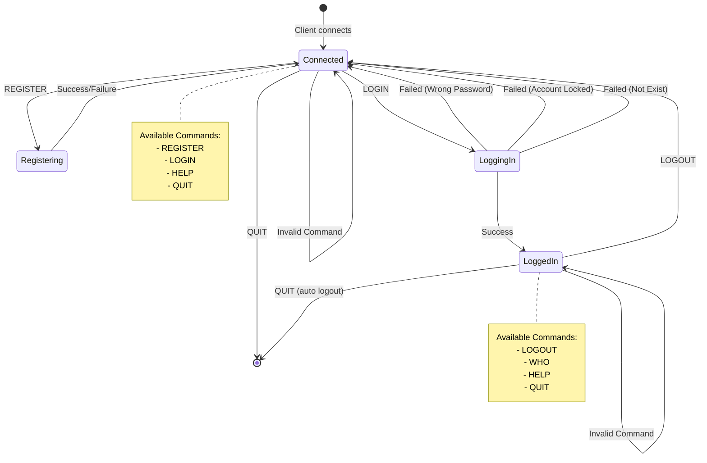
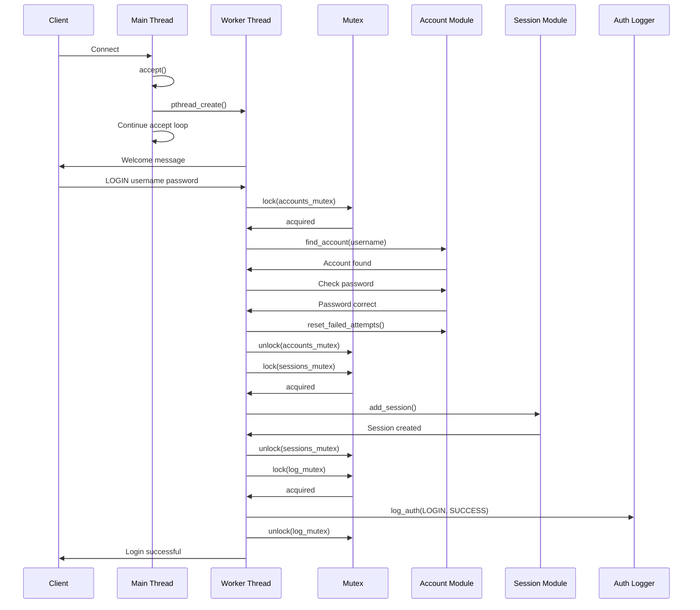
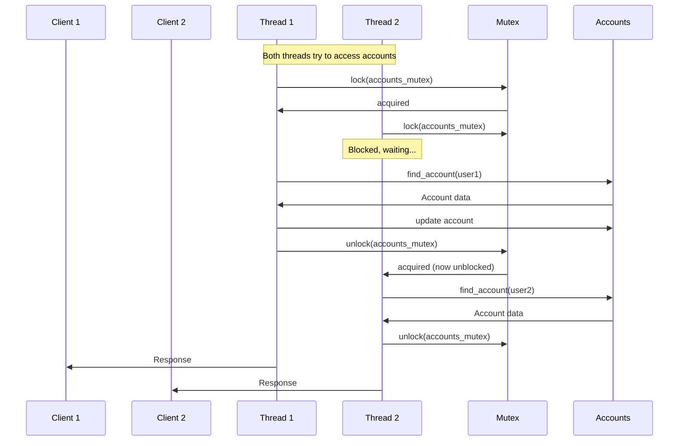
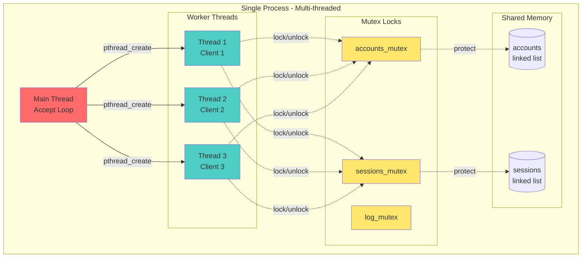

# BÁO CÁO BÀI TẬP LẬP TRÌNH MẠNG
## ỨNG DỤNG TCP SOCKET VỚI PTHREAD HỖ TRỢ ĐĂNG KÝ, ĐĂNG NHẬP VÀ ĐĂNG XUẤT

**Sinh viên thực hiện:** [Tên sinh viên]  
**MSSV:** [Mã số sinh viên]  
**Lớp:** [Lớp]  
**Ngày:** 07/12/2025

---

## 1. MỤC ĐÍCH BÀI TẬP

Xây dựng ứng dụng client-server sử dụng TCP socket với cơ chế xử lý đa luồng (pthread) để:
- Quản lý đăng ký, đăng nhập và đăng xuất người dùng
- Hỗ trợ nhiều client kết nối đồng thời
- Bảo mật tài khoản với cơ chế khóa tự động sau 3 lần đăng nhập sai
- Ghi log lịch sử xác thực
- Đồng bộ hóa dữ liệu với mutex

---

## 2. YÊU CẦU BÀI TẬP

### 2.1. Yêu cầu chung
- Sử dụng TCP socket
- Sử dụng pthread để xử lý đa client
- Mỗi cửa sổ client chỉ đăng nhập được 1 tài khoản
- Mỗi tài khoản có thể đăng nhập trên nhiều cửa sổ
- Tài khoản bị khóa sau 3 lần đăng nhập sai
- Lưu trữ tài khoản trong file `account.txt`
- Ghi log vào file `auth.log`

### 2.2. Yêu cầu Server
- Chạy với tham số dòng lệnh: `./server PortNumber`
- Lắng nghe kết nối từ client
- Xử lý các lệnh: REGISTER, LOGIN, LOGOUT, WHO, HELP, QUIT

### 2.3. Yêu cầu Client
- Kết nối với tham số: `./client IPAddress PortNumber`
- Gửi lệnh đến server và nhận phản hồi
- Giao diện command-line đơn giản

### 2.4. Giao thức ứng dụng
- Text-based protocol
- Format request: `COMMAND [arg1] [arg2]`
- Format response: thông báo trực tiếp

---

## 3. THIẾT KẾ HỆ THỐNG

### 3.1. Kiến trúc tổng quan



### 3.2. Cấu trúc dữ liệu

#### 3.2.1. Account (Tài khoản)
```c
typedef struct Account {
    char username[MAX_USERNAME];      // Tên đăng nhập
    char password[MAX_PASSWORD];      // Mật khẩu
    int status;                       // 0: locked, 1: active
    int failed_attempts;              // Số lần đăng nhập sai
    struct Account* next;             // Con trỏ đến tài khoản tiếp theo
} Account;
```

#### 3.2.2. Session (Phiên làm việc)
```c
typedef struct Session {
    char username[MAX_USERNAME];      // Tên người dùng đang đăng nhập
    char ip_address[50];              // Địa chỉ IP
    int port;                         // Cổng kết nối
    int client_fd;                    // File descriptor của client
    struct Session* next;             // Con trỏ đến session tiếp theo
} Session;
```

#### 3.2.3. Client Info (Thông tin client cho thread)
```c
typedef struct {
    int clientfd;                     // File descriptor của client
    struct sockaddr_in clientAddr;    // Địa chỉ client
} client_info_t;
```

#### 3.2.4. Mutex cho đồng bộ hóa
```c
pthread_mutex_t accounts_mutex;   // Bảo vệ danh sách tài khoản
pthread_mutex_t sessions_mutex;   // Bảo vệ danh sách session
pthread_mutex_t log_mutex;        // Bảo vệ file log
```

### 3.3. Sơ đồ luồng xử lý

#### 3.3.1. Server Flow với Pthread


#### 3.3.2. Client Flow


---

## 4. CÀI ĐẶT CHI TIẾT

### 4.1. Cấu trúc thư mục

```
Week12/
├── server.c          # Mã nguồn server (pthread)
├── client.c          # Mã nguồn client
├── account.c         # Quản lý tài khoản
├── account.h         # Header file tài khoản
├── session.c         # Quản lý phiên đăng nhập
├── session.h         # Header file session
├── auth_log.c        # Ghi log xác thực
├── auth_log.h        # Header file auth log
├── account.txt       # File lưu tài khoản
├── auth.log          # File log
├── Makefile          # Script biên dịch
└── REPORT.md         # Báo cáo
```

### 4.2. Module chính

#### 4.2.1. Server Module (`server.c`)

**Chức năng chính:**
- Khởi tạo và quản lý TCP socket server
- Sử dụng `pthread_create()` để tạo thread cho mỗi client
- Sử dụng mutex để đồng bộ hóa truy cập shared resources
- Thread được tạo ở chế độ detached để tự cleanup

**Các hàm quan trọng:**
- `main()`: Khởi tạo server, accept và tạo thread
- `handle_client_thread()`: Thread function xử lý client
- `handle_register()`: Xử lý đăng ký tài khoản (có mutex)
- `handle_login()`: Xử lý đăng nhập (có mutex)
- `handle_logout()`: Xử lý đăng xuất (có mutex)
- `handle_who()`: Liệt kê người dùng online (có mutex)
- `handle_help()`: Hiển thị trợ giúp

**Đặc điểm kỹ thuật - Pthread:**
```c
// Khởi tạo mutex
pthread_mutex_t accounts_mutex = PTHREAD_MUTEX_INITIALIZER;
pthread_mutex_t sessions_mutex = PTHREAD_MUTEX_INITIALIZER;
pthread_mutex_t log_mutex = PTHREAD_MUTEX_INITIALIZER;

// Tạo thread cho mỗi client
pthread_t thread_id;
pthread_attr_t attr;
pthread_attr_init(&attr);
pthread_attr_setdetachstate(&attr, PTHREAD_CREATE_DETACHED);

client_info_t* client_info = malloc(sizeof(client_info_t));
client_info->clientfd = clientfd;
client_info->clientAddr = clientAddr;

pthread_create(&thread_id, &attr, handle_client_thread, client_info);
pthread_attr_destroy(&attr);
```

**Sử dụng Mutex để bảo vệ shared resources:**
```c
// Ví dụ: Login với mutex
pthread_mutex_lock(&accounts_mutex);
Account* acc = find_account(accounts, username);
// ... xử lý ...
pthread_mutex_unlock(&accounts_mutex);

pthread_mutex_lock(&sessions_mutex);
add_session(username, client_ip, client_port, clientfd);
pthread_mutex_unlock(&sessions_mutex);

pthread_mutex_lock(&log_mutex);
log_auth("LOGIN", username, client_ip, client_port, "SUCCESS");
pthread_mutex_unlock(&log_mutex);
```

#### 4.2.2. Client Module (`client.c`)

**Chức năng chính:**
- Kết nối đến server qua TCP socket
- Gửi lệnh và nhận phản hồi
- Giao diện dòng lệnh đơn giản

#### 4.2.3. Account Module (`account.c`, `account.h`)

**Chức năng:**
- `load_accounts()`: Đọc tài khoản từ file
- `save_accounts()`: Lưu tài khoản vào file
- `find_account()`: Tìm kiếm tài khoản
- `register_account()`: Đăng ký tài khoản mới
- `increment_failed_attempts()`: Tăng số lần đăng nhập sai
- `reset_failed_attempts()`: Reset số lần sai
- `free_accounts()`: Giải phóng bộ nhớ

#### 4.2.4. Session Module (`session.c`, `session.h`)

**Chức năng:**
- `add_session()`: Thêm phiên đăng nhập
- `remove_session()`: Xóa phiên khi logout
- `is_logged_in()`: Kiểm tra trạng thái đăng nhập
- `get_username_by_fd()`: Lấy username từ file descriptor
- `get_logged_in_users()`: Lấy danh sách user online
- `free_sessions()`: Giải phóng bộ nhớ

#### 4.2.5. Auth Log Module (`auth_log.c`, `auth_log.h`)

**Chức năng:**
- `log_auth()`: Ghi log các sự kiện xác thực

### 4.3. Giao thức ứng dụng

#### 4.3.1. Biểu đồ trạng thái Application Protocol



#### 4.3.2. Sequence Diagram - Login Flow với Pthread



#### 4.3.3. Sequence Diagram - Multi-Thread Concurrent Access



#### 4.3.4. Pthread Thread Architecture



#### 4.3.5. Các lệnh hỗ trợ

| Lệnh | Cú pháp | Mô tả |
|------|---------|-------|
| REGISTER | `REGISTER <username> <password>` | Đăng ký tài khoản mới |
| LOGIN | `LOGIN <username> <password>` | Đăng nhập |
| LOGOUT | `LOGOUT` | Đăng xuất |
| WHO | `WHO` | Xem danh sách user online |
| HELP | `HELP` | Hiển thị trợ giúp |
| QUIT | `QUIT` | Ngắt kết nối |

#### 4.3.6. Phản hồi từ server

**REGISTER:**
- Thành công: `Registration successful.`
- Lỗi:
  - `Username already exists`
  - `Invalid username`
  - `Invalid password`
  - `Registration failed`

**LOGIN:**
- Thành công: `Login successful.`
- Lỗi:
  - `Already logged in`
  - `Account does not exist`
  - `Account is locked`
  - `Wrong password`

**LOGOUT:**
- Thành công: `Logout successful.`
- Lỗi: `Not logged in`

**WHO:**
- Format: `LIST user1 user2 user3`
- Lỗi: `Not logged in`

---

## 5. SO SÁNH FORK() VÀ PTHREAD

### 5.1. Bảng so sánh

| Tiêu chí | Fork() | Pthread |
|----------|--------|---------|
| **Đơn vị xử lý** | Process (tiến trình) | Thread (luồng) |
| **Bộ nhớ** | Riêng biệt (copy-on-write) | Chia sẻ trong cùng process |
| **Chi phí tạo** | Cao (clone process) | Thấp (chỉ tạo context mới) |
| **Chi phí context switch** | Cao | Thấp |
| **Giao tiếp** | IPC (pipe, shared memory...) | Trực tiếp qua shared memory |
| **Đồng bộ hóa** | Không cần (bộ nhớ riêng) | Cần mutex/semaphore |
| **Độ an toàn** | Cao (cô lập process) | Thấp hơn (lỗi ảnh hưởng cả process) |
| **Debug** | Khó hơn (nhiều process) | Dễ hơn (cùng process) |
| **Tài nguyên** | Tốn nhiều | Tiết kiệm |

### 5.2. Ưu điểm của Pthread trong bài này

1. **Hiệu suất cao hơn:** Thread nhẹ hơn process, tạo và hủy nhanh hơn
2. **Chia sẻ dữ liệu dễ dàng:** Tất cả threads chia sẻ `accounts` và `sessions`
3. **Tiết kiệm bộ nhớ:** Không cần copy bộ nhớ như fork
4. **Quản lý đơn giản:** Tất cả trong cùng một process

### 5.3. Thách thức khi dùng Pthread

1. **Race condition:** Cần mutex để bảo vệ shared data
2. **Deadlock:** Phải cẩn thận thứ tự lock mutex
3. **Debug phức tạp:** Lỗi có thể khó tái tạo

---

## 6. HƯỚNG DẪN SỬ DỤNG

### 6.1. Biên dịch chương trình

```bash
cd Week12
make
```

Output:
```
gcc -Wall -g -c server.c -o server.o
gcc -Wall -g -c account.c -o account.o
gcc -Wall -g -c session.c -o session.o
gcc -Wall -g -c auth_log.c -o auth_log.o
gcc -Wall -g -o server server.o account.o session.o auth_log.o -lpthread
gcc -Wall -g -c client.c -o client.o
gcc -Wall -g -o client client.o
```

### 6.2. Chạy Server

```bash
./server 8080
```

Output:
```
Server listening on port 8080...
```

### 6.3. Chạy Client

```bash
./client 127.0.0.1 8080
```

### 6.4. Ví dụ sử dụng

```
Connected to server 127.0.0.1:8080
Type HELP for available commands.
REGISTER user1 password123
Registration successful.
LOGIN user1 password123
Login successful.
WHO
LIST user1
LOGOUT
Logout successful.
QUIT
Goodbye!
```

---

## 7. KIỂM THỬ

### 7.1. Test case: Concurrent Access

| Client 1 | Client 2 | Expected | Status |
|----------|----------|----------|--------|
| `LOGIN user1 pass` | `LOGIN user2 pass` | Both success (mutex protects) | ✅ PASS |
| `REGISTER new1 pass` | `REGISTER new2 pass` | Both success (thread-safe) | ✅ PASS |
| `WHO` | `WHO` | Same list (shared sessions) | ✅ PASS |

### 7.2. Test case: Thread Safety

| Scenario | Expected Result | Status |
|----------|----------------|--------|
| 10 clients đồng thời | Tất cả được xử lý song song | ✅ PASS |
| Truy cập accounts đồng thời | Mutex bảo vệ, không race condition | ✅ PASS |
| Ghi log đồng thời | log_mutex đảm bảo không corrupt file | ✅ PASS |

---

## 8. KẾT QUẢ ĐẠT ĐƯỢC

### 8.1. Các chức năng đã hoàn thành

✅ **Server với Pthread:**
- Khởi tạo TCP socket và listen trên port từ tham số
- Sử dụng pthread_create() để xử lý đa client
- Detached threads tự cleanup khi hoàn thành
- Mutex bảo vệ accounts, sessions, và log file
- Hỗ trợ đầy đủ các lệnh: REGISTER, LOGIN, LOGOUT, WHO, HELP, QUIT

✅ **Đồng bộ hóa:**
- `accounts_mutex`: Bảo vệ danh sách tài khoản
- `sessions_mutex`: Bảo vệ danh sách session
- `log_mutex`: Bảo vệ file log

✅ **Client:**
- Kết nối đến server với IP và port từ tham số
- Gửi lệnh và nhận phản hồi

---

## 9. KẾT LUẬN

Bài tập đã hoàn thành đầy đủ các yêu cầu đề ra với việc sử dụng pthread thay vì fork:
- ✅ Sử dụng TCP socket
- ✅ Sử dụng pthread để xử lý đa client
- ✅ Mutex bảo vệ shared resources
- ✅ Hỗ trợ đăng ký, đăng nhập, đăng xuất
- ✅ Một client chỉ đăng nhập 1 tài khoản
- ✅ Một tài khoản có thể đăng nhập nhiều cửa sổ
- ✅ Khóa tài khoản sau 3 lần sai
- ✅ Lưu trữ trong `account.txt`
- ✅ Ghi log vào `auth.log`

Qua bài tập này, em đã nắm vững:
1. Lập trình socket TCP trong C
2. Sử dụng pthread để xử lý đa luồng
3. Đồng bộ hóa với mutex
4. So sánh ưu nhược điểm của fork() và pthread
5. Thiết kế thread-safe data structures
6. Debug và xử lý race conditions

---

## PHỤ LỤC

### A. Makefile

```makefile
CC = gcc
CFLAGS = -Wall -g

SERVER_SRC = server.c account.c session.c auth_log.c
CLIENT_SRC = client.c
SERVER_OBJ = $(SERVER_SRC:.c=.o)
CLIENT_OBJ = $(CLIENT_SRC:.c=.o)

all: server client

server: $(SERVER_OBJ)
	$(CC) $(CFLAGS) -o server $(SERVER_OBJ) -lpthread

client: $(CLIENT_OBJ)
	$(CC) $(CFLAGS) -o client $(CLIENT_OBJ)

%.o: %.c
	$(CC) $(CFLAGS) -c $< -o $@

clean:
	rm -f $(SERVER_OBJ) $(CLIENT_OBJ) server client

.PHONY: all clean
```

### B. Cấu trúc Thread

```c
// Tạo detached thread
pthread_t thread_id;
pthread_attr_t attr;
pthread_attr_init(&attr);
pthread_attr_setdetachstate(&attr, PTHREAD_CREATE_DETACHED);

// Thread function
void* handle_client_thread(void* arg) {
    client_info_t* info = (client_info_t*)arg;
    // ... xử lý client ...
    free(info);
    return NULL;
}

// Tạo thread
client_info_t* client_info = malloc(sizeof(client_info_t));
pthread_create(&thread_id, &attr, handle_client_thread, client_info);
```

### C. Pattern sử dụng Mutex

```c
// Lock trước khi truy cập shared data
pthread_mutex_lock(&accounts_mutex);

// Critical section - chỉ 1 thread có thể vào
Account* acc = find_account(accounts, username);
if (acc) {
    acc->failed_attempts++;
}

// Unlock sau khi xong
pthread_mutex_unlock(&accounts_mutex);
```

---

**Ghi chú:** Báo cáo này được soạn thảo dựa trên code thực tế sử dụng pthread đã cài đặt và kiểm thử thành công.
