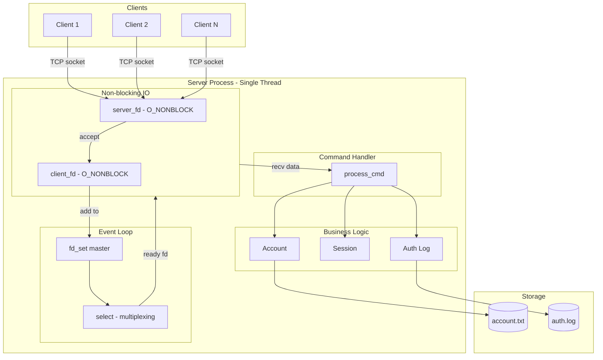
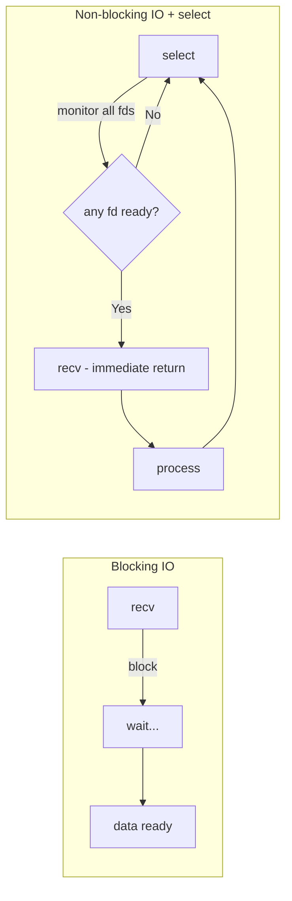
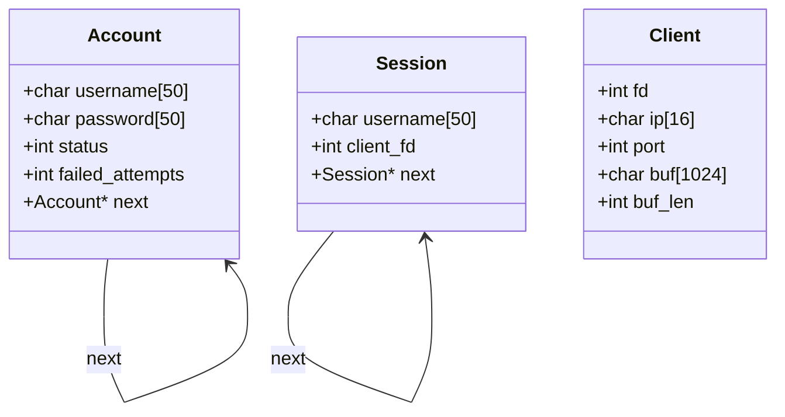
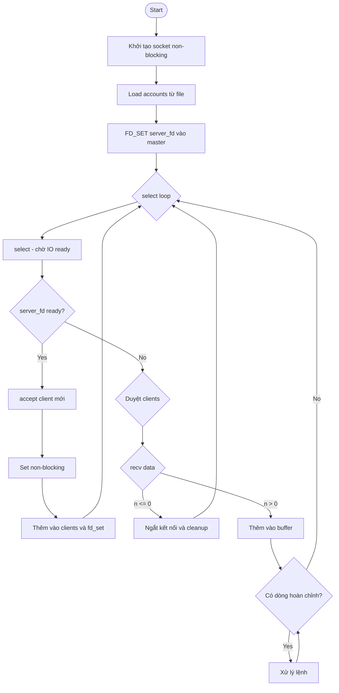
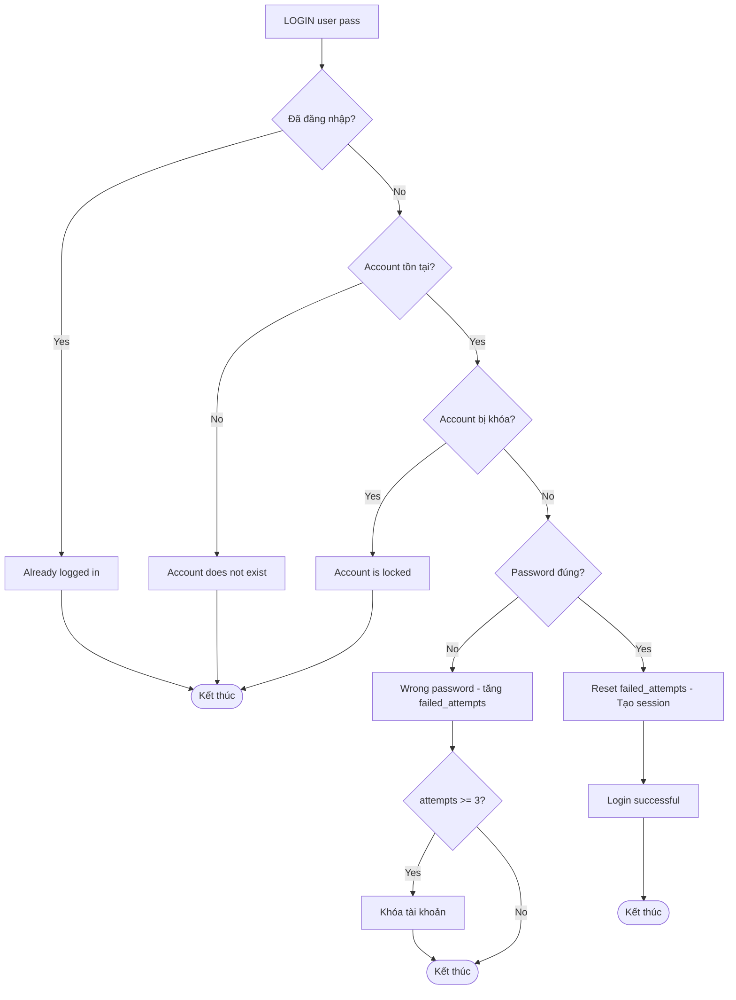
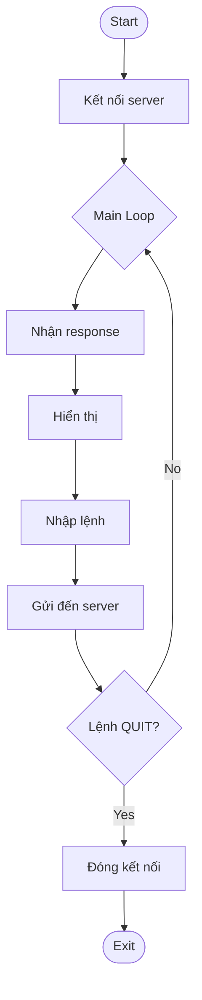
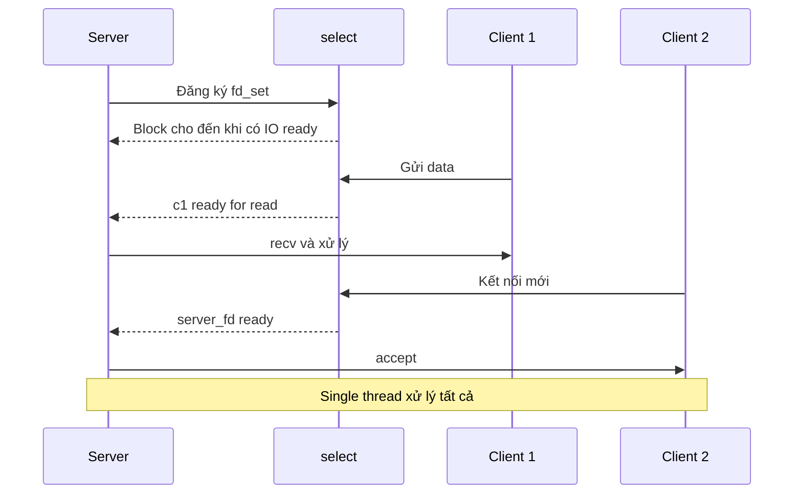

# BÁO CÁO BÀI TẬP LẬP TRÌNH MẠNG

## Ứng dụng TCP Server với Non-blocking I/O và select()

**Tuần:** 14 - Network Programming  
**Ngày:** 23/12/2025

---

## 1. Giới thiệu

### 1.1. Mục tiêu
Xây dựng hệ thống client-server TCP hỗ trợ:
- Đăng ký, đăng nhập, đăng xuất người dùng
- Xử lý đồng thời nhiều client bằng **Non-blocking I/O với select()**
- Khóa tài khoản sau 3 lần nhập sai mật khẩu
- Ghi log các hoạt động xác thực

### 1.2. Công nghệ sử dụng
- **Ngôn ngữ:** C
- **I/O Model:** Non-blocking với select()
- **Giao thức:** TCP/IP, text-based protocol
- **Lưu trữ:** File-based (account.txt, auth.log)

---

## 2. Kiến trúc hệ thống

### 2.1. Tổng quan kiến trúc



### 2.2. Mô hình Non-blocking IO với select



**Giải thích:**
- **fd_set master**: Tập hợp tất cả file descriptors cần theo dõi
- **select**: System call chờ đến khi có ít nhất 1 fd sẵn sàng đọc/ghi
- **O_NONBLOCK**: Flag đặt socket ở chế độ non-blocking, recv/send không block
- **Single thread**: Một vòng lặp xử lý tất cả clients tuần tự

### 2.2. Cấu trúc module

| Module | File | Chức năng |
|--------|------|-----------|
| Server | server.c | Main loop, xử lý lệnh, quản lý client |
| Account | account.c/h | CRUD tài khoản, load/save file |
| Session | session.c/h | Quản lý phiên đăng nhập |
| Auth Log | auth_log.c/h | Ghi log xác thực |
| Client | client.c | Giao diện người dùng |

---

## 3. Thiết kế chi tiết

### 3.1. Cấu trúc dữ liệu



**Giải thích:**
- **Account:** Linked list lưu thông tin tài khoản, `status=0` là bị khóa
- **Session:** Linked list lưu phiên đăng nhập, map `client_fd` với `username`
- **Client:** Mảng tĩnh trong server, lưu buffer để xử lý partial reads

### 3.2. Giao thức ứng dụng

| Lệnh | Cú pháp | Yêu cầu đăng nhập | Mô tả |
|------|---------|-------------------|-------|
| REGISTER | `REGISTER <user> <pass>` | Không | Tạo tài khoản mới |
| LOGIN | `LOGIN <user> <pass>` | Không | Đăng nhập |
| LOGOUT | `LOGOUT` | Có | Đăng xuất |
| WHO | `WHO` | Có | Danh sách user online |
| HELP | `HELP` | Không | Hướng dẫn sử dụng |
| QUIT | `QUIT` | Không | Ngắt kết nối |

---

## 4. Luồng xử lý

### 4.1. Server Main Loop



### 4.2. Xử lý Login



### 4.3. Client Flow



---

## 5. Non-blocking I/O với select()

### 5.1. Nguyên lý hoạt động



### 5.2. Ưu điểm so với Multi-threading

| Tiêu chí | pthread | select |
|----------|---------|--------|
| **Memory** | Stack riêng mỗi thread | Shared memory |
| **Synchronization** | Cần mutex/semaphore | Không cần |
| **Context Switch** | Tốn CPU | Không có |
| **Complexity** | Race conditions | Linear, dễ debug |
| **Scalability** | ~1000 threads | ~1000+ connections |

### 5.3. Xử lý Partial Reads

Do non-blocking mode, recv có thể trả về data không đầy đủ. Server sử dụng buffer để ghép các phần:

```
Lần 1: recv() → "LOG"
Lần 2: recv() → "IN user"
Lần 3: recv() → " pass\n"
Buffer: "LOGIN user pass\n" → Xử lý
```

---

## 6. Quản lý tài khoản

### 6.1. File Format (account.txt)
```
username1 password1 1
username2 password2 0
```
- Cột 3: `1` = active, `0` = locked

### 6.2. Cơ chế khóa tài khoản
- Mỗi lần sai password: `failed_attempts++`
- Khi `failed_attempts >= 3`: `status = 0` (khóa)
- Đăng nhập thành công: `failed_attempts = 0`

---

## 7. Logging

### 7.1. Format log (auth.log)
```
[2025-12-23 14:30:00] LOGIN alice from 127.0.0.1:45678 SUCCESS
[2025-12-23 14:30:05] LOGIN bob from 127.0.0.1:45679 FAIL
[2025-12-23 14:30:10] ACCOUNT_LOCKED bob
[2025-12-23 14:31:00] LOGOUT alice from 127.0.0.1:45678
```

### 7.2. Các sự kiện được log
- LOGIN (success/fail)
- LOGOUT
- REGISTER
- ACCOUNT_LOCKED

---

## 8. Kết luận

### 8.1. Kết quả đạt được
- ✅ Server xử lý đồng thời nhiều client với single thread
- ✅ Hệ thống xác thực đầy đủ (register/login/logout)
- ✅ Bảo mật với cơ chế khóa tài khoản
- ✅ Logging đầy đủ các hoạt động
- ✅ Code tối ưu, modular (~540 dòng)

### 8.2. Hạn chế
- Chưa mã hóa password
- Chưa hỗ trợ IPv6
- Giới hạn 100 client đồng thời (có thể tăng)

### 8.3. Hướng phát triển
- Sử dụng epoll thay select cho Linux
- Thêm mã hóa TLS/SSL
- Hash password với bcrypt/argon2
